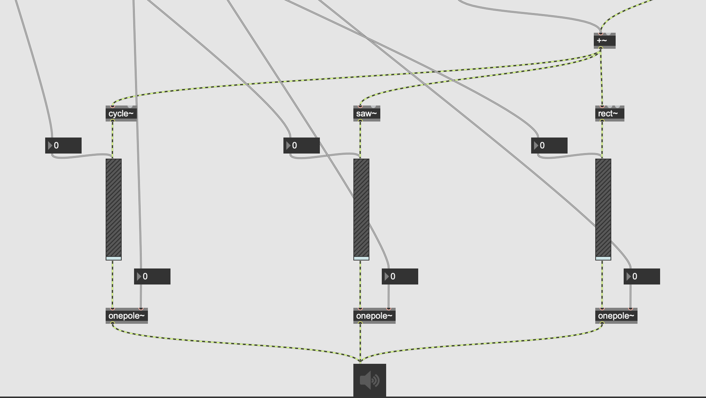

# Project Report: Arduino and Max MSP Synthesizer

## Introduction
Simple synthesizer to manipulate a MIDI generated sound using Arduino and Max MSP. Can control gain and lowpass for sine, square, and sawtooth waves, as well as a pitch bend and vibrato effect. Here is a quick overview of the project:

### Arduino
The code is linked [here](synthesizer/synthesizer.ino). The code is broken down into 3 parts: setup, loop, and functions. It is fairly self-explanatory, apart from the switch cases that are used to update the values one per pass.

 is an image of the board:
Here, the board can be divided in 4 parts:
1. First potentiometer controls the gain/volume
2. Second potentiometer controls the lowpass filter
3. Button controls the waveform toggle (sine, square, sawtooth, off)
4. Joystick, where y-axis controls the pitch bend and x-axis controls the vibrato, and pressing the joystick toggles the vibrato on/off.

### Max MSP

This is the max patch linked [here](synthesizer.maxpat). We can break it down in multiple parts.

#### 1. ArduinoIn

The patch sends a bang every 10ms and receives the serial messages printing from the arduino file. It removes whitespace characters (i.e. " " and "\n") before unpacking and sending all the messages to different parts of the board.

#### 2. NoteIn

This is the part of the patch that receives the MIDI signal from the Arduino. It is a simple notein object that outputs the note number and translates it to a frequency using the mtof object. The patch has a loadbang object that sets the note to middle C when the patch is loaded.

#### 3. Gain, lowpass, toggle

Here, the gain/volume and lowpass values are received and mapped from range [0 1023] to [0 100]. This is then sent to 2 different gates that are controlled by the button. Every time the button is pressed, a counter is increased to iterate through the 4 possible states (sine, sawtooth, square, off).

#### 4. Pitch bend and vibrato

The pitch bend values is received and mapped from range [0 1023] to [50 -50] to represent a pitch bend of -50 cents to +50 cents. This cent value is then sent through a few objects to compute the final pitch bent frequency: \[ f_2 = f_1 \times 2^{\frac{\text{cent}}{100}} \]. 
Similarly, the vibrato is mapped from [0 1023] to [5 10] and then conditionally sent to a sine wave as its frequency. Whenever the joystick is pressed, it updates a counter (similar to the button) that will iterate through the 2 possible states (vibrato on/off). If it is off, then the sine wave will have frequency of 0hz and so not exist. Otherwise, the sine wave is then multiplied by 3 (the modulation depth) before being multiplied with the pitch bent frequency to get the vibrato effect.

#### 5. Synthesis

The final part of the patch is the synthesis. The frequency (which could be pitch bent and/or vibrated), gain, and lowpass values are sent to their own max object to create the sound. The frequency is sent to a cycle object that outputs a sine wave. This sine wave is then multiplied by the gain value and sent to a lowpass filter, which is controlled by the lowpass value and outputs the final sound.

## Demo
[here](images/demo.mp4)

## Difficulties and Limitations
The building of the board and Arduino file was fairly straightforward, but the making of the max patch was more intricate than expected. The state logic for the button and joystick was a bit tricky to implement, as it took me time to find that the gate objects exists. Pitch bend logic was also tricky, especially with max being finicky with passing floats or ints. The main limitation of the synthesizer is that it is not polyphonic, so only one note can be played at a time. This is due to the fact that the notein object only outputs one note at a time, and the patch is not able to handle multiple notes at once. The breaboard being somewhat small made it tricky to control the joystick and button, as they were not as stable as I would have liked.

## Future Improvements
A larger breadboard would be nice, as it could handle more potentiometers to further shape the sound. A polyphonic synthesizer would also be nice, as it would allow for more complex sounds and to create more pad like sounds. 

## Conclusion
Overall, the project was a great learning experience. I learned a lot about Arduino and Max MSP, and how to use them together to control and output sound. It also taught me more about sound synthesis and how to manipulate sound to create different effects.